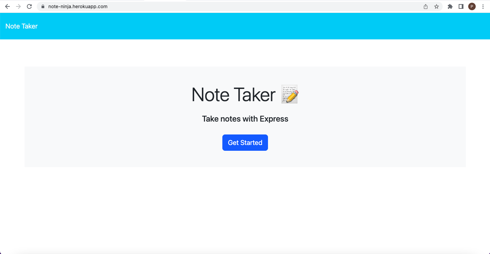

# Note-Taker

## Description
My motivation for this app was to become a more skilled developer to help me prepare for a career in the field. The reason I built this app was to showcase my skills that I've learned throughout my bootcamp experience and to also build upon those skills. This web application solves the problem of wanting to have a note taking app to write and save notes to help with daily activities or to use as reminders. While building this, I learned how to use HTML and API routes and how to use get, post, and delete requests to handle JSON data and show it in HTML files. This was also my first time using localhost and deploying an app to the web, which has taught me the usefulness of platforms such as Heroku, Microsoft Azure, and Google App Engine.
  
## Table of Contents 
* [Installation](#installation)
* [Usage](#usage)
* [Credits](#credits)
* [Questions](#questions)
      
## Installation
To install this application, you must be working on node.js version 16.0 to version 18.16. To install node.js go to [Node.js](https://nodejs.org), which gives insturctions on how to install this back-end JavaScript runtime environment. Next, you will need to clone the repository to your local machine using 'git clone https://github.com/pjt3232/Note-Taker.git' in your terminal. Then with the repo cloned, type 'npm install' in your terminal to download the necessary npm pacakages for the app. You can then run the app locally using 'npm start', with the last step being opening your browser at 'http://localhost:3001'.
  
## Usage
If you do not wish to install the app, it is on the web at the url 'https://note-ninja.herokuapp.com/'. The opening page of the URL should should match the screenshot below:

To start using the app click the "Get Started" button on the opening page. On the next page, the app allows you to type a note with a title and text body. To save this note, click the floppy disk icon in the upper right of the page and the note will be saved in the column on the left. Then once you have a note saved in the left-hand column, you can click on the title of the note to open it or you can click the red trash can icon to delete the note. If you're displaying a note and want to write a new one, just click the '+' icon on the upper right of the page to show an empty note.

## Credits
I used a starter code for this project. The starter code is the second commit on my repo and it makes up the gitignore file and all of the public folder, besides the images folder containing the screenshot of the deployed application. The public folder contains the index.js file, the styling for the web page, and the HTML files for the two pages of the app. The creators of the starter code and the location of the starter code on GitHub can be found below:

Creators: 
- xandromus@github.com
- Georgeyoo@github.com
- nol166@github.com

URL of starter code: https://github.com/coding-boot-camp/miniature-eureka

## Questions
If you have any questions or issues, feel free to reach out to me on [GitHub](https://github.com/pjt3232) or contact me at 20peytra@gmail.com.
